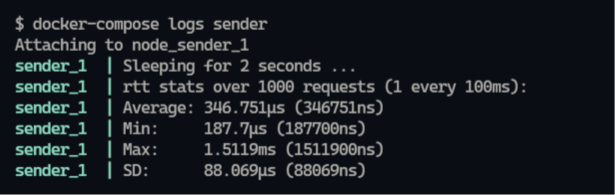

# Microservice HTTP Overhead Tests

After a little discussion on my [dev discord](https://discord.zekro.de) about the overhead of JSON REST communication between microservices, I was curious how much overhead pure HTTP JSON REST communication actually introduces.

The test setup consists of two services, one as server and one as sender/receiver. Both inside Docker containers communicating over a private Docker network.

The sender crafts a JSON REST request, sent to the server which deserializes the received payload, adds timestamps and then serializes the object again to a JSON payload responded to the sender.

The sender then repeats this and measures the average RTT inclusive the serialization and deserializition times of the sender itself.

> The following results below were tested on Docker for Windows (WSL2) v20.10.6.

